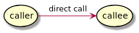
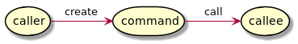
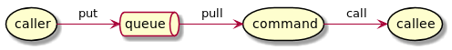
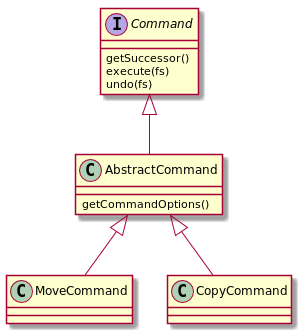
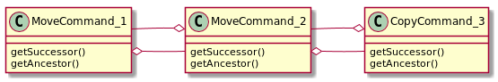
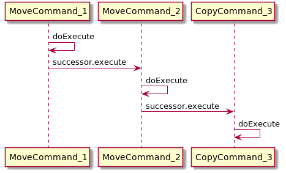
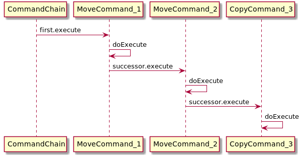
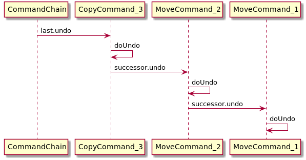

= Command

With the command pattern you can decouple caller and callee of an api.

Here is a direct call:

The command object encapsulates the call:

Command objects can be used to transport calls. A queue can be used to transport commands for async calls:

== Command Example File Operations

We wand to write a small script engine for simple file operations.
Every operation should be managed as single command. Commands ca be
linked to a command chain.

Changes performed by commands can be reverted by an undo function.

=== Command Classes

=== Command Chains

Commands can be connected to each other by the attributes successor and ancestor.

In the link:../../main/java/com/trustedshops/examples/javaDesignPatterns/command/commands/AbstractCommand.java[AbstractCommand] class you can see the chain execution code:

[source,java]
----
include::../../main/java/com/trustedshops/examples/javaDesignPatterns/command/commands/AbstractCommand.java[lines=27..32]
----

This is how the commands will be executed:

==== Undo Command chain

For the undo command we have to call the undo function of all commands in *reverse* order. Therefor we have to stat with the last Command and then call the ancestor in the link:../../main/java/com/trustedshops/examples/javaDesignPatterns/command/commands/AbstractCommand.java[AbstractCommand] class.

[source,java]
----
include::../../main/java/com/trustedshops/examples/javaDesignPatterns/command/commands/AbstractCommand.java[lines=35..40]
----

To find the last element of a command chain we use the special helper Command link:../../main/java/com/trustedshops/examples/javaDesignPatterns/command/commands/CommandChain.java[CommandChain] class.

This class has no functionality by it self, it only forward the execute or undo call to the command objects.

For undo the CommandChain starts with the last command:

