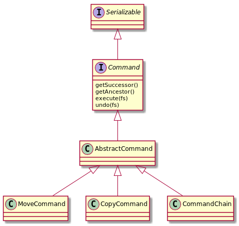

= Command

We wand to write a small script engine for simple file operations.
Every operation should be managed as single command. Commands ca be
linked to a command chain.

Changes performed by commands can be reverted by an undo function.

== Command Classes

== Command Chains

