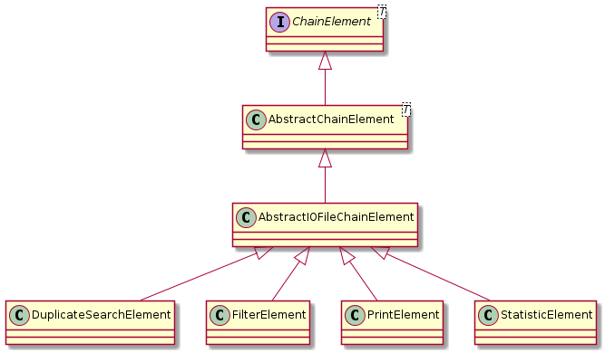

= Java Design Patterns

== Patterns

=== Chain of Responsibility

We want to process files trough a chain off elements. We want to generate statistics, find duplicated files, filter files and print filenames to the console.

For this pattern you need only one Abstract base class.

==== The Base class:

[source,java]
----
include::../../main/java/com/trustedshops/examples/javaDesignPatterns/chain/ChainElement.java[lines=1..-1]
----

see link:../../main/java/com/trustedshops/examples/javaDesignPatterns/chain/ChainElement.java[ChainElement.java]

==== How to use the Chain

Create the root element and add the preceding elemnts by using the setSucessor method.

[source,java]
----
include::../../test/java/com/trustedshops/examples/javaDesignPatterns/chain/filechain/FileChainTest.java[lines=31..45]
----

see link:../../test/java/com/trustedshops/examples/javaDesignPatterns/chain/filechain/FileChainTest.java[FileChainTest.java]

== Quickstart

build the project:

  $ gradle build

run tests:

  $ gradle test

run the project:

  $ ./build/libs/javaDesignPatterns.jar
