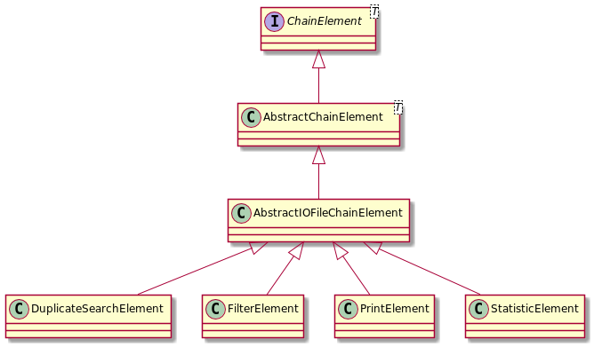
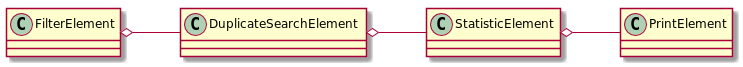

= Chain of Responsibility

We want to process files trough a chain off elements. We want to generate statistics, find duplicated files, filter files and print filenames to the console.

For this pattern you need only one Abstract base class.

== The Base Class

The interface link:../../main/java/com/trustedshops/examples/patterns/chain/ChainElement.java[ChainElement] describes the necessary functions.

[source,java]
----
package com.trustedshops.examples.petterns.chain;

public interface ChainElement<T> {
    ChainElement<T> getSucessor();

    ChainElement<T> setSucessor(ChainElement<T> sucessor);

    void execute(T item);
}
----

== How to use the Chain

Create the root element and add the preceding elemnts by using the setSucessor method (see link:../../test/java/com/trustedshops/examples/petterns/chain/filechain/FileChainTest.java[FileChainTest]).

[source,java]
----
FilterElement filterElement = new FilterElement(".exe");
        StatisticElement statisticFileElement = new StatisticElement();
DuplicateSearchElement duplicateFileSearchElement = new DuplicateSearchElement();
PrintElement printer = new PrintElement();

filterElement.setSucessor(statisticFileElement);
statisticFileElement.setSucessor(duplicateFileSearchElement);
duplicateFileSearchElement.setSucessor(printer);

AbstractIOFileChainElement root = filterElement;

for(IOFile file: FILES) {
    root.execute(file);
}
----

